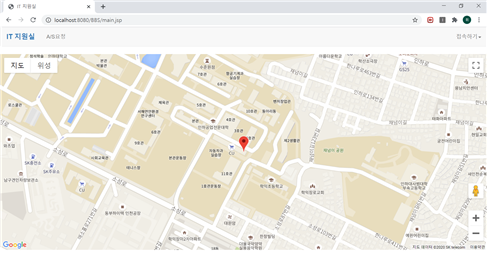
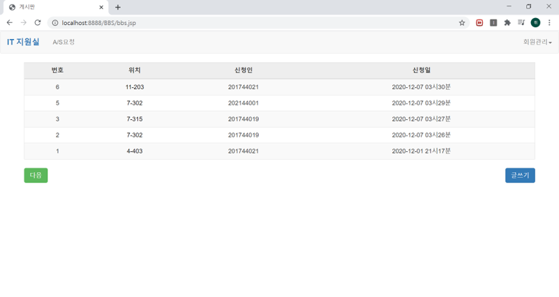
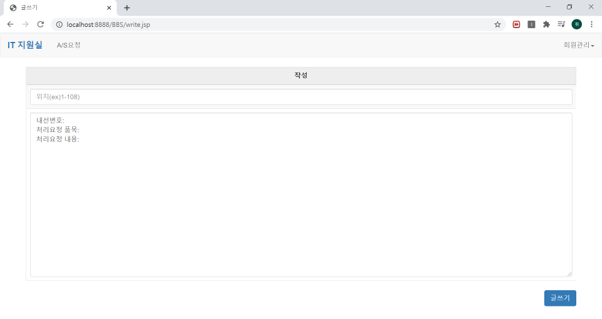

# After_Service_Board
JSP를 이용해 구현한 A/S요청 웹 게시판

-------------------------------------------

- 메인 페이지에서 Google Maps API 연동을 통해 IT지원실 사무실 위치 지도위에 마커로 표시

- 게시글 형태로 A/S요청 접수

-------------------------------------------

<실행화면>

  
